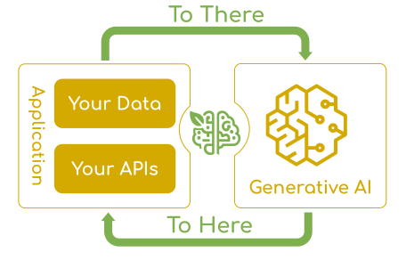

# Spring AI Learning Roadmap  

We will learn **Spring AI** in phases for better understanding of the concepts and with a strong focus on hands-on practice.  

---

## What is Spring AI?  

> **Definition:**  
> Spring AI is a framework that integrates AI models (LLMs, embeddings, image generation, and more) into **Spring applications** through consistent abstractions, simple configuration, and production-ready integrations.  
> 

1. **what It provides:**

   - Unified APIs for interacting with AI models (chat, embeddings, images, etc.).

    - Plug-and-play providers (OpenAI, Gemini, Ollama, Azure OpenAI, Amazon Bedrock, HuggingFace, etc.).

    - High-level features like RAG (Retrieval Augmented Generation), tool/function calling, memory, and prompt templates. 

   - Production-ready support for observability, metrics, cost tracking, and guardrails.

2. **Why Spring AI Exists**

- Without Spring AI, integrating LLMs is messy:

  - Each provider (OpenAI, Anthropic, Azure) has its own API style.

  - You’d manually handle authentication, HTTP calls, retries, error handling, etc.

  - No built-in production tooling for monitoring token usage, tracing calls, or swapping providers.

- Spring AI solves this by:

  - Standardizing APIs across providers (write once, swap providers).

  - Giving you Spring Boot-style beans & configuration.

  - Adding AI-specific middleware (advisors, memory, vector stores).

  - Integrating Micrometer Observability so you can see performance, errors, and cost impact in real-time.

3. **Core Concepts in Spring AI**

    | Concept                          | Purpose                                                                            |
    | -------------------------------- | ---------------------------------------------------------------------------------- |
    | **ChatClient**                   | High-level interface for sending prompts & receiving responses.                    |
    | **ChatModel**                    | Provider-specific implementation (e.g., OpenAIChatModel).                          |
    | **EmbeddingModel**               | Converts text/images into embeddings (vectors) for search/RAG.                     |
    | **ImageModel**                   | Generates or manipulates images using AI models.                                   |
    | **Advisors**                     | Middleware components that process prompts & responses (RAG, guardrails, logging). |
    | **Memory**                       | Stores conversation history to enable context persistence.                         |
    | **VectorStore**                  | Database for embeddings (PGVector, Pinecone, Elasticsearch, etc.).                 |
    | **Observability**                | Tracks performance, errors, token usage, and costs.                                |
    | **MCP (Model Context Protocol)** | Exposes your tools/data to AI agents like Copilot.                                 |

4.  High-Level Architecture

        ┌─────────────────────────┐
        │ Your Application Code   │
        │ (REST, CLI, WebSocket)  │
        └─────────────┬───────────┘
                    │
            ┌───────▼────────┐
            │  ChatClient    │ ← You interact here
            └───────┬────────┘
                    │
            Advisors Chain
        (RAG, Memory, Guardrails)
                    │
            ┌───────▼────────┐
            │ ChatModel      │ ← Provider API wrapper
            │ EmbeddingModel │
            │ ImageModel     │
            └───────┬────────┘
                    │
            AI Provider API (OpenAI, Gemini, etc.)
                    │
            Provider Response
                    │
        ┌───────────▼───────────┐
        │ Spring AI Response API │
        └────────────────────────┘

5. What You Can Build with Spring AI

   - Chatbots (text/voice, single or multi-turn)

  - Q&A over documents (RAG pipelines)

    - Data extraction (e.g., turn messy text into structured JSON)

    - Function calling (LLM-triggered backend actions)

    - Image generation/editing

    - Multi-model orchestration (route requests to the best model for the job)

    - Agent frameworks (tools + memory + planning)

